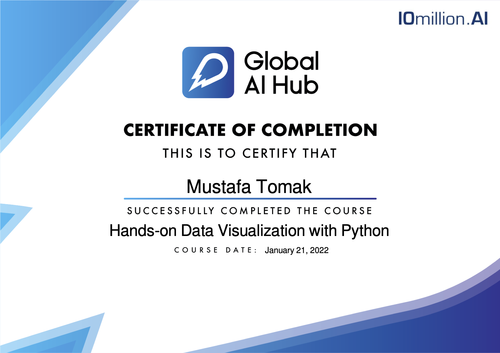

# Global AI Hub - Hands-on Data Visualization Kurs Sonu Çalışması
Global AI Hub tarafından düzenlenen Hands-on Data Visualization kursunda, kurs sonu çalışması olarak işlenen data görselleştirme çalışması bulunmaktadır. Bu projede, Kaggle sitesinden alınan "World Happiness Report" isimli data kullanılmıştır.

### Sertifika

